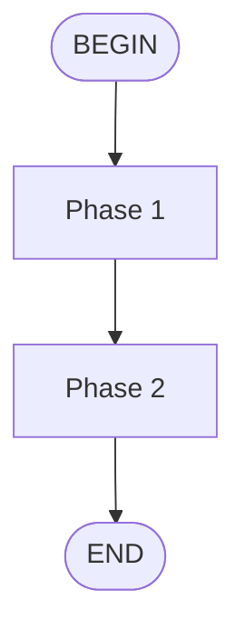

# API Changes: Add Flow Skill Support

## New Commands

| Command | Description | Usage |
|---------|-------------|-------|
| `/flow:sk-team-feature-flow` | Automated full feature development | `/flow:sk-team-feature-flow Add OAuth login` |
| `/flow:sk-team-quick-flow` | Automated quick fix workflow | `/flow:sk-team-quick-flow Fix typo` |

## New Skill Format

### Flow Skill Frontmatter

```yaml
---
name: sk-example-flow
description: Automated workflow example
type: flow  # <-- NEW: Required for flow skills
platforms:
  kimi: true
---
```

### Mermaid Diagram

Flow skills must include a Mermaid diagram defining execution phases:



## New Artifacts Format

### SUMMARY.md
Executive summary for stakeholders:
- Overview paragraph
- Key decisions
- Files changed table
- Testing notes
- Deployment notes

### API_CHANGELOG.md
For frontend teams:
- New endpoints table
- Modified endpoints table
- Request/response examples
- Breaking changes with migration guide
- Deprecations

### OPERATIONAL_TASKS.md
Call to action for managers/devops:
- Pre-deployment tasks checklist
- Environment variables needed
- External service setup steps
- Database migrations
- Post-deployment verification
- Rollback plan
- Contacts

## Breaking Changes

- [ ] None

## Migration Guide

No migration needed. New features are additive.

## Deprecations

None.

---

**Note**: This is a framework/documentation feature. No actual API endpoints were changed.
