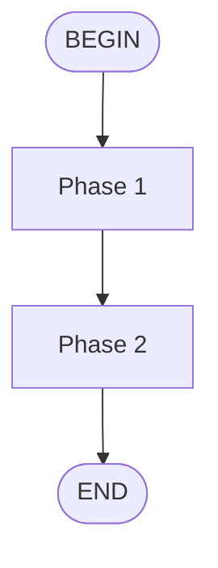

# Technical Design: Add Flow Skill Support

## Overview

Implement automated workflow execution through "flow skills" — a new skill type that executes multi-phase agent workflows without manual orchestration.

## Architecture

### Component Diagram

```
┌─────────────────────────────────────────────────────────────┐
│                      FLOW SKILL SYSTEM                       │
├─────────────────────────────────────────────────────────────┤
│                                                              │
│  ┌──────────────┐      ┌──────────────┐     ┌──────────┐    │
│  │ Flow Skill   │─────▶│ Mermaid      │────▶│ Executor │    │
│  │ (SKILL.md)   │      │ Parser       │     │ Engine   │    │
│  └──────────────┘      └──────────────┘     └────┬─────┘    │
│       ▲                                          │          │
│       │                                          ▼          │
│       │                                    ┌──────────┐     │
│       │                                    │ Subagent │     │
│       │                                    │ Task     │     │
│       │                                    └──────────┘     │
│       │                                                     │
│       └────────────────────────────────────────────────     │
│                    workflow/flows/                          │
└─────────────────────────────────────────────────────────────┘
```

### New Components

1. **Flow Skill Format** (`type: flow`)
   - YAML frontmatter with `type: flow`
   - Mermaid diagram defining execution flow
   - Phase descriptions with agent assignments

2. **Directory Structure**
   - `workflow/flows/` — dedicated directory for flow skills
   - Mirrors existing `workflow/skills/` pattern

3. **Installation Support**
   - Update `scripts/install-kimi.sh` to link flow skills
   - Follow same symlinking pattern as standard skills

### Modified Components

1. **`scripts/install-kimi.sh`**
   - Add section to install flow skills from `workflow/flows/`
   - Display count of installed flow skills

2. **`adapters/kimi/README.md`**
   - Add flow skills documentation section
   - Explain difference between `/skill:` and `/flow:`

## Data Flow

1. User executes `/flow:sk-team-feature-flow <request>`
2. Kimi reads `SKILL.md` with `type: flow`
3. Parses Mermaid diagram for execution path
4. Executes each node sequentially:
   - SETUP → ANALYST → ARCHITECT → TESTER → DEVELOPER → REVIEWER → ACCEPTANCE
5. Handles decision points (loops, escalations)
6. Reports completion or failure

## API Design

### Flow Skill Interface

```markdown
---
name: sk-example-flow
type: flow
description: Automated example workflow
---



## Phase: PHASE1
Agent: agent-name
Prompt: |
  Instructions for this phase...
```

### Phase Definition Format

Each phase specifies:
- **Name**: Phase identifier (matches diagram node)
- **Agent**: Subagent to invoke
- **Prompt Template**: With `{variables}`
- **Output**: Expected artifacts
- **Next**: Success/failure routing

## File Structure

```
workflow/
├── skills/                    # Existing standard skills
│   ├── sk-team-feature/
│   ├── sk-team-quick/
│   └── ...
└── flows/                     # NEW: Flow skills
    ├── sk-team-feature-flow/
    │   └── SKILL.md
    └── sk-team-quick-flow/
        └── SKILL.md
```

## Dependencies

- Kimi CLI with `/flow:` command support
- Existing agent team (product-analyst, architect, etc.)
- Mermaid diagram parsing (handled by Kimi)

## Security Considerations

- Flow skills execute automatically — no human confirmation between phases
- YOLO mode considerations for file modifications
- Subagent permissions inherited from main agent

## Performance Considerations

- Flow execution may take longer than interactive orchestration
- Consider context window usage across multiple subagent calls
- Loops (review rejections) bounded to prevent infinite execution

## Error Handling

| Failure Point | Behavior |
|---------------|----------|
| SETUP fails | Report directory creation error |
| Agent fails | Report phase and preserve artifacts |
| Review rejects | Loop back (max 3 iterations) |
| Acceptance fails | Route to appropriate phase |

## Testing Strategy

1. **Manual testing** of both flow skills
2. **Verify** all artifacts created correctly
3. **Test** review rejection loop
4. **Confirm** installation script works
