# /flow:sk-team-feature-flow - Feature Development with Approval Gates

Complete feature development workflow with user approval required between each phase.

```mermaid
flowchart TD
    START([BEGIN]) --> SETUP[Setup: Confirm Feature Name]
    SETUP --> WORKTREE[Create Git Worktree]
    WORKTREE --> ANALYST{Product Analyst}

    ANALYST -->|Asks user questions| ANALYST_Q[User Q&A]
    ANALYST_Q -->|Creates proposal.md| APPROVAL1{User Approval?}

    APPROVAL1 -->|Approved| RESEARCH_ASK{Research needed?}
    APPROVAL1 -->|Redo| ANALYST

    RESEARCH_ASK -->|Yes| RESEARCHER{Researcher}
    RESEARCH_ASK -->|Skip| ARCHITECT{Architect}
    RESEARCHER -->|Creates RESEARCH.md| APPROVAL1_5{User Approval?}
    APPROVAL1_5 -->|Approved| ARCHITECT
    APPROVAL1_5 -->|Redo| RESEARCHER

    ARCHITECT -->|Asks user questions| ARCHITECT_Q[User Q&A]
    ARCHITECT_Q -->|Creates design.md + tasks.md| APPROVAL2{User Approval?}

    APPROVAL2 -->|Approved| DOC_REVIEW_ASK{Doc Review needed?}
    APPROVAL2 -->|Redo| ARCHITECT

    DOC_REVIEW_ASK -->|Yes| DOC_REVIEWER{Doc Reviewer}
    DOC_REVIEW_ASK -->|Skip| TESTER{Tester}
    DOC_REVIEWER -->|Asks user questions| DOC_REVIEWER_Q[User Q&A]
    DOC_REVIEWER_Q -->|Creates DOC_REVIEW.md| APPROVAL2_5{User Approval?}
    APPROVAL2_5 -->|Approved| TESTER
    APPROVAL2_5 -->|Redo| DOC_REVIEWER
    APPROVAL2_5 -->|Issues found| IDENTIFY2{Route to phase}

    TESTER -->|Proposes test plan| TESTER_Q[User approves plan]
    TESTER_Q -->|Creates failing tests| APPROVAL3{User Approval?}
    APPROVAL3 -->|Approved| DEVELOPER{Developer}
    APPROVAL3 -->|Redo| TESTER

    DEVELOPER -->|Implements code| APPROVAL4{User Approval?}
    APPROVAL4 -->|Approved| REVIEWER{Code Reviewer}
    APPROVAL4 -->|Redo| DEVELOPER

    REVIEWER -->|Approved| APPROVAL5{User Approval?}
    REVIEWER -->|Changes Requested| DEVELOPER
    APPROVAL5 -->|Approved| ACCEPTANCE{Acceptance Reviewer}
    APPROVAL5 -->|Redo| REVIEWER

    ACCEPTANCE -->|Accepted| APPROVAL6{User Approval?}
    ACCEPTANCE -->|Needs Work| IDENTIFY{Identify Phase}
    APPROVAL6 -->|Approved| COMPLETE([END])

    IDENTIFY -->|Planning issue| ARCHITECT
    IDENTIFY -->|Implementation issue| DEVELOPER
    IDENTIFY -->|Requirements issue| ANALYST

    IDENTIFY2 -->|Planning issue| ARCHITECT
    IDENTIFY2 -->|Requirements issue| ANALYST
```



## Core Principle

**NEVER proceed to next phase without explicit user approval.**

Each phase ends with:
1. Summary of what was done
2. Location of artifacts
3. **ASK for approval to proceed**
4. Option to redo phase with feedback

---

## Phase Details

### 1. SETUP - Feature Setup
**Agent**: Orchestrator (main)

**Actions**:
1. Extract feature name from user request (kebab-case)
2. **Ask user to confirm the feature name**
3. Create git worktree: `git worktree add ../<feature-name>-worktree -b feature/<feature-name>`
4. Create directory `openspec/changes/<feature-name>/` in the worktree

**Output**: Worktree and directory ready

---

### 2. ANALYST - Product Analyst
**Agent**: product-analyst

**Prompt Template**:
```
Feature request: {user_request}
Feature name: {feature_name}
Worktree: ../{feature_name}-worktree

YOUR TASK:
1. READ the existing codebase to understand context (quick scan)
2. ASK USER clarifying questions using AskUserQuestion tool
   - MINIMUM 3 questions, up to 5
   - Ask about: target users, key use cases, constraints, edge cases
3. PRESENT your understanding back to the user via AskUserQuestion:
   - "Here's what I understand we're building: [summary]. Correct?"
4. WAIT for user confirmation
5. Only AFTER user approves — create proposal.md

Create requirements in: openspec/changes/{feature_name}/proposal.md

CRITICAL RULES:
- You MUST use AskUserQuestion BEFORE creating proposal.md
- Do NOT create proposal.md until user confirms your understanding
- If you skip questions and go straight to writing, you have FAILED
```

**Output**: `openspec/changes/{feature_name}/proposal.md`
**Post-phase**: Show summary → **WAIT FOR USER APPROVAL** → proceed or redo

---

### 2.5. RESEARCHER - Research (OPTIONAL)
**Agent**: researcher

**When to include**: Product Analyst flagged need for research OR user requests it.

**Prompt Template**:
```
Feature: {feature_name}
Worktree: ../{feature_name}-worktree
Proposal: openspec/changes/{feature_name}/proposal.md

Research areas:
- [Area 1]
- [Area 2]

Investigate unknown areas before planning.
Create RESEARCH.md with findings and recommendations.
```

**Output**: `openspec/changes/{feature_name}/RESEARCH.md`
**Post-phase**: Show summary → **WAIT FOR USER APPROVAL** → proceed or redo

---

### 3. ARCHITECT - System Design
**Agent**: architect

**Prompt Template**:
```
Feature: {feature_name}
Worktree: ../{feature_name}-worktree
Proposal: openspec/changes/{feature_name}/proposal.md

YOUR TASK:
1. READ proposal.md thoroughly
2. EXPLORE codebase to understand existing patterns
3. ASK USER clarifying questions using AskUserQuestion tool
   - MINIMUM 2-3 questions
   - Present technical approach options with trade-offs
   - Ask about integration preferences and technology choices
4. PRESENT your technical approach via AskUserQuestion
5. WAIT for user confirmation
6. Only AFTER user approves — create design.md and tasks.md

CRITICAL RULES:
- You MUST use AskUserQuestion BEFORE creating design.md or tasks.md
- Do NOT create design files until user confirms your approach
- If you skip questions and go straight to writing, you have FAILED
```

**Output**: `design.md` + `tasks.md`
**Post-phase**: Show summary → **WAIT FOR USER APPROVAL** → proceed or redo

---

### 3.5. DOC_REVIEWER - Documentation Review (OPTIONAL)
**Agent**: doc-reviewer

**When to include**: Recommended for complex features. Ask user.

**Prompt Template**:
```
Feature: {feature_name}
Worktree: ../{feature_name}-worktree
Artifacts:
- openspec/changes/{feature_name}/proposal.md
- openspec/changes/{feature_name}/design.md
- openspec/changes/{feature_name}/tasks.md

Review all documentation for consistency, gaps, and alignment.
Build traceability matrix: requirement → design → task.
Ask user clarifying questions to verify their mental model.
Create DOC_REVIEW.md with findings and verdict.
```

**Output**: `openspec/changes/{feature_name}/DOC_REVIEW.md`
**Post-phase**: Show summary → **WAIT FOR USER APPROVAL** → proceed or redo
**If NEEDS_CLARIFICATION**: Route to appropriate phase (Architect or Product Analyst)

---

### 4. TESTER - TDD Red Phase
**Agent**: tester

**Prompt Template**:
```
Feature: {feature_name}
Worktree: ../{feature_name}-worktree
Artifacts:
- openspec/changes/{feature_name}/proposal.md
- openspec/changes/{feature_name}/design.md
- openspec/changes/{feature_name}/tasks.md

YOUR TASK:
1. READ all artifacts and analyze existing test patterns
2. DETECT project type (web app, API, library, CLI)
3. PROPOSE a categorized test plan to user via AskUserQuestion:
   - Unit tests (with descriptions)
   - Integration tests (with descriptions)
   - Service tests (with descriptions)
   - E2E tests — OPTIONAL (ask user if they want these)
4. WAIT for user to approve/modify/skip groups
5. Only AFTER approval — write the approved tests

CRITICAL RULES:
- You MUST present the test plan BEFORE writing any test code
- User can skip entire groups (e.g., "Skip E2E", "Skip unit tests")
- User can modify specific tests (add/remove)
- If user wants E2E tests, ask about credentials and infrastructure
- Store E2E credentials in .env.test.local (not committed)
- Do NOT write tests until user approves the plan
- If you skip the test plan and go straight to writing, you have FAILED
```

**Output**: Test files (failing state)
**Post-phase**: Show summary with groups (approved/skipped) → **WAIT FOR USER APPROVAL** → proceed or redo

---

### 5. DEVELOPER - TDD Green Phase
**Agent**: developer

**Prompt Template**:
```
Feature: {feature_name}
Worktree: ../{feature_name}-worktree
Artifacts:
- openspec/changes/{feature_name}/proposal.md
- openspec/changes/{feature_name}/design.md
- openspec/changes/{feature_name}/tasks.md

Implement code to make all tests pass.
Follow existing project patterns.
Do not modify test files.
```

**Output**: Implementation (tests passing)
**Post-phase**: Show summary → **WAIT FOR USER APPROVAL** → proceed or redo

---

### 6. REVIEWER - Code Review
**Agent**: code-reviewer

**Prompt Template**:
```
Feature: {feature_name}
Worktree: ../{feature_name}-worktree
Design: openspec/changes/{feature_name}/design.md

Review the implementation for:
- Code quality and patterns
- Security issues
- Performance concerns
- Test coverage

Return verdict: APPROVED or CHANGES_REQUESTED with specific feedback.
```

**Output**: Review verdict
**Loop**: If CHANGES_REQUESTED → back to DEVELOPER (max 3 iterations)
**Post-phase**: Show summary → **WAIT FOR USER APPROVAL** → proceed or redo

---

### 7. ACCEPTANCE - QA Verification
**Agent**: acceptance-reviewer

**Prompt Template**:
```
Feature: {feature_name}
Worktree: ../{feature_name}-worktree
Proposal: openspec/changes/{feature_name}/proposal.md

Verify all acceptance criteria are met by the implementation.
Check:
- All acceptance criteria satisfied
- Edge cases handled
- No regressions

Create artifacts:

1. VERIFICATION.md
   - Test results
   - Criteria checkoff
   - Final verdict: ACCEPTED or NEEDS_WORK

2. SUMMARY.md (if ACCEPTED)
   - Executive summary
   - Key decisions made
   - Files changed

3. API_CHANGELOG.md (if ACCEPTED and API changes exist)
   - New endpoints with examples
   - Modified endpoints
   - Breaking changes with migration guide

4. OPERATIONAL_TASKS.md (if ACCEPTED)
   - External service setup (OAuth apps, etc.)
   - Environment variables needed
   - Database migrations
   - Pre/post deployment tasks
   - Rollback plan
```

**Output**: `openspec/changes/{feature_name}/VERIFICATION.md`
**Loop**: If NEEDS_WORK → IDENTIFY phase
**Post-phase**: Show summary → **WAIT FOR USER APPROVAL** → finalize

---

### 8. IDENTIFY - Issue Routing
**Agent**: Orchestrator (main)

**Determines**:
- Requirements issue → ANALYST
- Design issue → ARCHITECT
- Implementation issue → DEVELOPER

---

## Approval Prompt Template

After EACH phase, show:

```markdown
## Phase X Complete: [Phase Name]

### Summary
[2-3 sentences about what was accomplished]

### Artifacts Created
- `openspec/changes/<feature-name>/[artifact]` - [description]

### Key Decisions
- [Decision 1]
- [Decision 2]

---

## APPROVAL REQUIRED

Options:
1. **"Approved"** → Proceed to next phase
2. **"Show me [artifact]"** → Display full content for review
3. **"Redo"** → Re-run current phase with your feedback
4. **"Modify: [changes]"** → Make specific adjustments
5. **"Cancel"** → Abort the workflow

Next: [Phase Name]
```

---

## Handling Redo Requests

When user asks to redo a phase:
1. Ask what specifically needs to change
2. Re-invoke the same agent with feedback context
3. The agent MUST address ALL feedback points
4. Show summary again after redo → ask for approval again

---

## Usage

### Start workflow:
```
/sk-team-feature Add user authentication with OAuth2
```

### With specific context:
```
/sk-team-feature Implement caching layer for API responses
  - Use Redis
  - TTL: 5 minutes for most endpoints
  - Bypass cache for authenticated mutations
```

## Artifacts

All outputs stored in:
```
openspec/changes/<feature-name>/
├── proposal.md              # Requirements (Product Analyst)
├── RESEARCH.md              # Research findings (Researcher, optional)
├── design.md                # Technical design (Architect)
├── tasks.md                 # Task breakdown (Architect)
├── DOC_REVIEW.md            # Documentation review (Doc Reviewer, optional)
├── VERIFICATION.md          # QA verification (Acceptance Reviewer)
├── SUMMARY.md               # Executive summary (Acceptance Reviewer)
├── API_CHANGELOG.md         # API changes for frontend (Acceptance Reviewer)
└── OPERATIONAL_TASKS.md     # Call to action for ops (Acceptance Reviewer)
```

### Artifact Purposes

| Artifact | Audience | Purpose |
|----------|----------|---------|
| proposal.md | Product, Dev | What and why |
| RESEARCH.md | Architect, Dev | Technology findings |
| design.md | Developers | How to implement |
| tasks.md | Developers | What to do |
| DOC_REVIEW.md | Tech Lead, Dev | Alignment verification |
| VERIFICATION.md | QA, Tech Lead | Quality gate |
| SUMMARY.md | Stakeholders, Management | What was delivered |
| API_CHANGELOG.md | Frontend Team | How to integrate |
| OPERATIONAL_TASKS.md | DevOps, Managers | What to set up |
