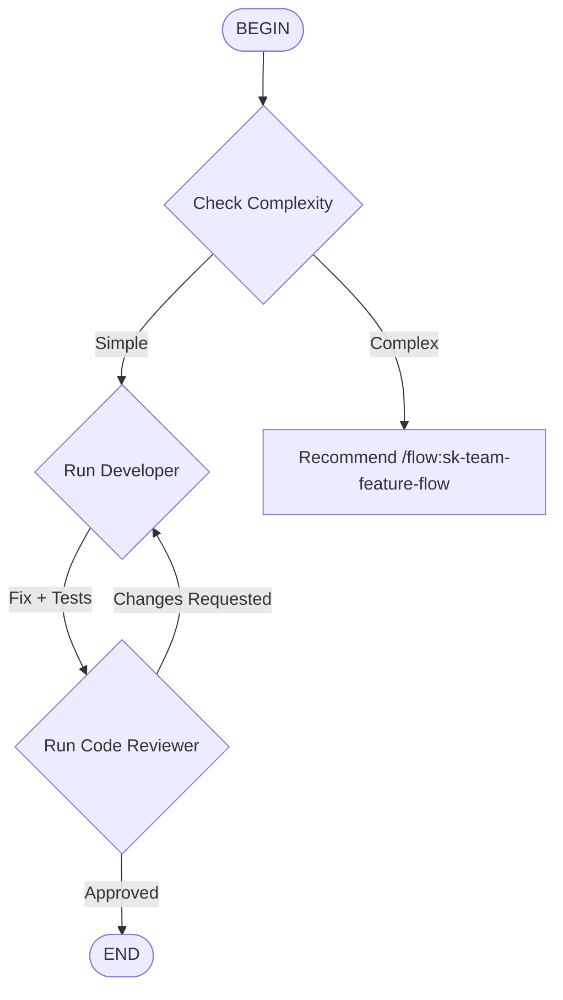

# /flow:sk-team-quick-flow - Automated Quick Fix

Streamlined workflow for small changes. Skips formal requirements and design phases.



## When to Use

**Good for:**
- Bug fixes
- Typos
- Single file changes
- Clear, defined tasks

**NOT for:**
- New features
- Multi-component changes
- Design decisions needed

## Phase Details

### 1. CHECK - Complexity Check
**Agent**: Orchestrator (main)

**Determines** if this is truly a quick fix or needs full workflow.

**Escalation criteria:**
- Requires design decisions
- Touches multiple components
- New data models needed
- Complex logic

---

### 2. DEVELOPER - Fix Implementation
**Agent**: developer

**Prompt Template**:
```
Quick fix request: {user_request}

This is a QUICK fix - no formal proposal or design needed.

Steps:
1. Understand the issue
2. Write test reproducing the bug (if applicable)
3. Implement minimum fix
4. Verify all tests pass

Do NOT refactor unrelated code.
```

**Output**: Fix + Tests

---

### 3. REVIEWER - Quality Check
**Agent**: code-reviewer

**Prompt Template**:
```
Quick fix: {user_request}

Review for:
- Correctness
- No regressions
- Security (if relevant)
- Code style compliance

Return: APPROVED or CHANGES_REQUESTED
```

**Output**: Review verdict
**Loop**: If CHANGES_REQUESTED → back to DEVELOPER (max 2 iterations)

---

## Usage

```
/flow:sk-team-quick-flow Fix null pointer in login handler
```

```
/flow:sk-team-quick-flow Fix typo in README installation section
```

## Comparison

| Aspect | /skill:sk-team-quick | /flow:sk-team-quick-flow |
|--------|---------------------|-------------------------|
| Complexity check | Manual | Automatic |
| Control | Orchestrator decides | Flow diagram decides |
| Best for | Uncertain scope | Clear quick fixes |

## Artifacts

For quick fixes, minimal documentation:

```
openspec/changes/<fix-name>/
├── SUMMARY.md          # Brief description of the fix
└── OPERATIONAL_TASKS.md # Only if needed (env vars, etc.)
```

**Note:** Quick fixes skip formal proposal/design/verification phases. The Developer creates a brief SUMMARY, and operational tasks are only added if the fix requires external setup (rare for quick fixes).
